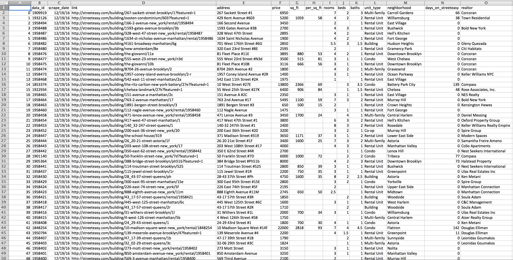

# streeteasy_scrape

Python code for scraping real-estate data from a popular rental listings web page.

## Important
As of 2/20/2017, Streeteasy.com has blocked web scraping (https://www.distilnetworks.com/).  Consider https://rentlogic.com/ as a potential alternative data source.

## About
This repository contains a Python script for scraping and formatting rental listings
from the popular NYC rental listings web page www.streeteasy.com. 

The core function is streeteasy_scrape_public.py.  By default, it will loop over all listings on the website producing ~27,000 listings on any given day. The results are saved in .csv format.  An example dataset, 2016-12-20.csv, is included. 

## Data

The following variables are formatted and saved in the csv file:
- **data_id:** a unique integer identifying each listing
- **scrape_date:** the date on which the data were collected
- link: the listing url
- address: the street address of the listing 
- price: monthly rental price (USD)
- sq_ft: the area of the listing in square feet.  Blank if not found.
- per_sq_ft: price per square foot (USD). Blank if not found.
- rooms: total number of rooms. Blank if not found.
- beds: total number of bedrooms. Blank if not found.
- baths: total number of bathrooms
- unit_type: type of listing (Rental Unit, Condo, Multi-family, Town house, Co-op, Building, House)
- neighborhood: NYC neighborhood name
- days_on_streeteasy: number of days that the listing has been on streeteasy. Blank if not found.
- realtor: name of realtor. Blank if not found.
- amenities: The following columns will return 1 if the amenity is listed, 0 if not.
    - bike room, board approval required, cats and dogs allowed, central air conditioning,concierge, cold storage, community recreation facilities, children's playroom,deck, dishwasher, doorman, elevator, full-time doorman, furnished, garage parking, green building, gym, garden, guarantors accepted, laundry in building, live-in super, loft, package room, parking available, patio, pets allowed, roof deck, smoke-free, storage available, sublet, terrace, virtual doorman, washer/dryer in-unit, waterview, waterfront
- transportation: The following columns will return the distance (in miles) to the following subway lines and trains.  Distances under  50 ft are reported as 50ft.  Blanks (NaNs) indicate that this train is approximately >1.8 mi away.
    - Line A, Line C, Line E, Line B, Line D, Line F, Line M, Line G, Line L, Line J, Line Z, Line N, Line Q, Line R, Line 1, Line 2, Line 3, Line 4, Line 5, Line 6, Line 7, Line S, LIRR, PATH

## Example output

Small preview of one session of scraped and formatted data in .csv format.  Amenities and transportation variables are not shown.  Download the 2016-12-20.csv example data file to see the full output.

 

If desired, two functions are included to format the data into a SQLite local database.  The function csv2sql.py will perform additional formatting and add the resulting table to a SQLite local database.  The function mergeSQL.py will merge tables collected on different days within the SQLite database into a single table after removing duplicates.
